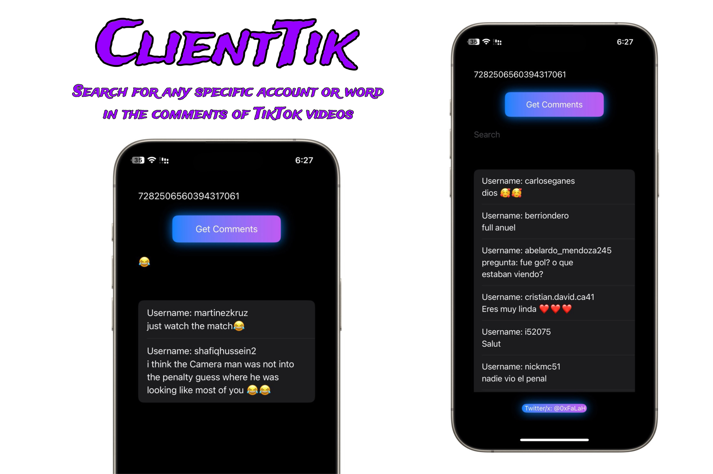

# ClientTik



ClientTik is an iOS app built with SwiftUI for searching and analyzing large volumes of TikTok comments. It helps you find a specific word, phrase, or account among thousands of comments in seconds, instead of scrolling manually.

## Features

- **Fast comment search** — filter thousands of comments by keyword or account instantly.
- **Fetch & browse** — pull comments for a video and browse them in a clean, organized list.
- **Save results** — keep the comments or searches you care about for later.
- **Export** — export search results for use outside the app.
- **Stats at a glance** — quick summary tiles for what you're looking at.

## Requirements

- Xcode 15 or later
- iOS 16 or later
- Swift 5.9+

## Installation

### Run from source

1. Clone the repository.
2. Open `ClientTik/Appnew.xcodeproj` in Xcode.
3. Select a simulator or a connected device and press Run.

### Install the prebuilt IPA

`ClientTik.ipa` is provided for direct installation. It requires a valid signature to install on a physical device — on a Mac, you can sign and install it directly through Xcode.

## Project structure

```
ClientTik/Appnew/
├── About/         App info screen
├── Comments/      Comment models and UI
├── Components/    Shared reusable views
├── Core/          Formatters, haptics, theming
├── Export/        Export service
├── Fetch/         Fetching comments from a video
├── Networking/    TikTok service layer
└── Saved/         Saved items store and screen
```

## License

This project is provided as-is for personal and educational use.
