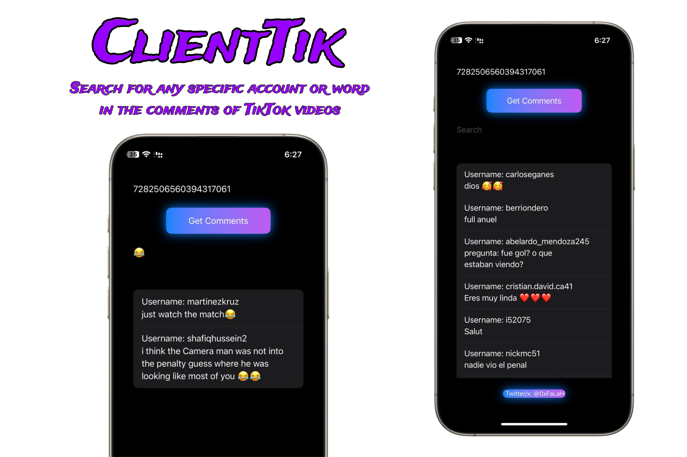

# ClientTik-Swift-ios

ClinetTik is an application that allows you to efficiently search through large numbers of comments
It enables users to search for specific text or accounts, even among thousands of comments, saving time and simplifying 
the search and analysis process. The app utilizes innovative techniques to extract important information swiftly from a vast volume of comments
Additionally, it facilitates easy searching for a specific word or account among thousands of accounts and comments

Note : The ClientTik.IPA application requires a signature ✍️ for installation on your device. If you have a Mac, you can install it directly using Xcode 🧑‍💻
